# ESPHome Alien EVSE
[![GitHub Activity][commits-shield]][commits]
[![Last Commit][last-commit-shield]][commits]
[![Platform][platform-shield]](https://github.com/esphome)

This project [kosl/alienevse](https://github.com/kosl/alienevse) lets you use an ESP32 device to manage charging any vehicle with [ESPHome](https://esphome.io). 
It requires a simple hardware modification that can be added to any commercial charging station and provides ESPHome EVSE addon that can control charging by dynamically setting charging current, while charging and can schedule charging availability if car is connected. With [Home Assistant](https://www.home-assistant.io) automation it can follow available power from solar inverter or follow grid peak shaving, multiple cars power balancing and other tarif requirements.
 
| Controls | Sensors | Diagnostic |
| - | - | - |
| 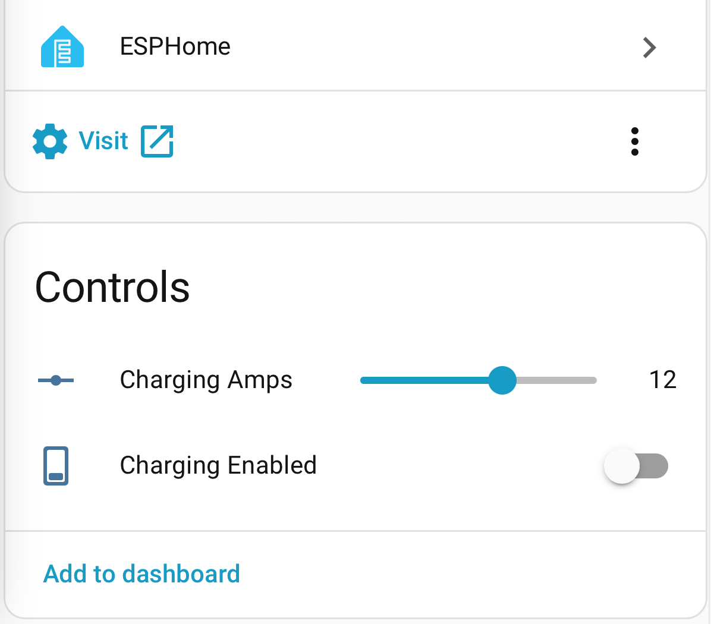 | 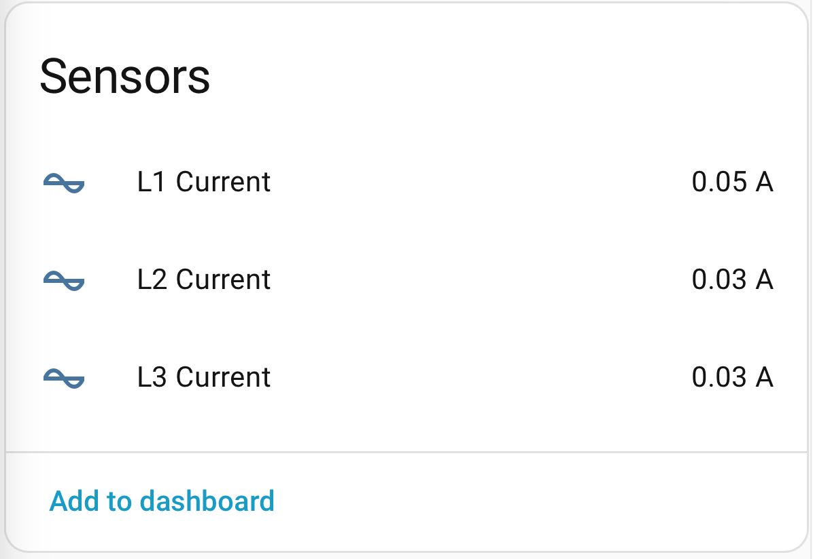 |  |

## Features
- Configuration with ESPHome YAML only (see [esphome/alienevse.yaml](esphome/alienevse.yaml) as an example).
- Setting current and enabling/disabling charging.
- Sensors (optional) for current transformers (CT) can be attached inside wallbox providing parallel measurements. Instead of internal CT clamp measurements, external CTs for measuring grid currents for "solar charging" or similar strategies can be used.
- Standalone web portal (use without Home Assistant) and built in automation is in principle possible.
- Cheap DIY (under €10) hardware and easy modification of any commercial charger. Existing charger electronics is left intact. Only Control Pilot (CP) wire is split inside charger.
- Testing  of the AlienEVSE board can be done without the charger since the board provides CP signal for the vehicle and for the charger. 
- Can be used with commercial chargers for one or three phases. 

## Theory of operation
According to EN 61851-1 standard the theory of charger (EVSE) to vehicle (EV) communication is as depicted in the following figure.

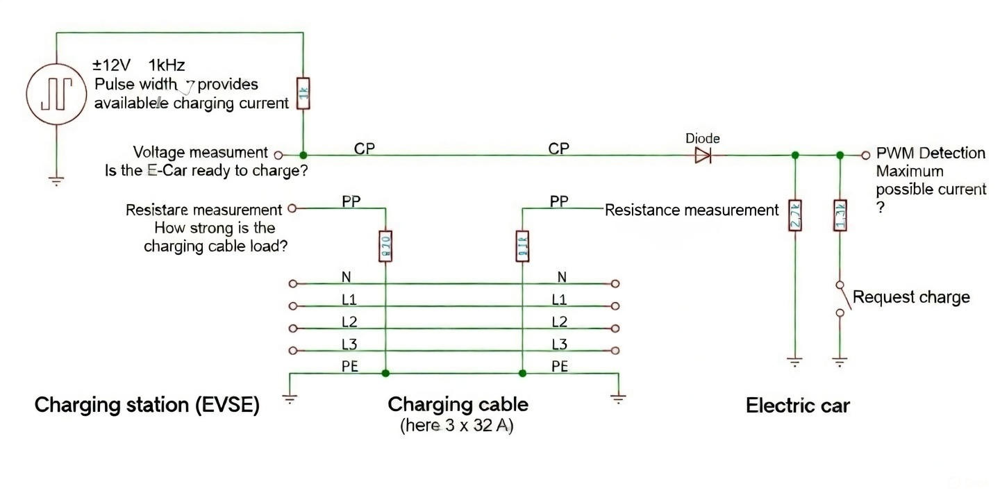

AlienEVSE steps in the middle of above communication and takes over control of the Control Pilot (CP) signal.
With CP signal to the Charger it fakes vehicle being connected. AlienEVSE with CP signal to the vehicle (EV) it fakes charger being connected.

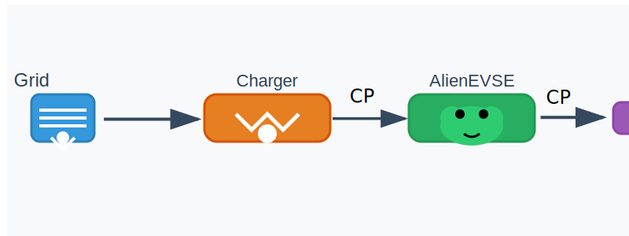

The CP signal is the only thing needed to communicate with EV and to control charging current with pulse width modulation (PWM) that operates at frequency of 1kHz.
To generate CP for vehigle and to signal CP to Charger/Wallbox a processor is required with only few additional analog circuits to generate signals ranging from +12 V to -12 V. 

| CP State  | Name / Meaning                            | CP Voltage (≈) |       PWM Duty Cycle | What PWM Means                                | EVSE / EV Action                            |
| --------- | ----------------------------------------- | -------------: | -------------------: | --------------------------------------------- | ------------------------------------------- |
| **A**     | No EV connected                           |       +12 V DC | **N/A** (or 100% DC) | No current advertised                         | EVSE idle, contactors open                  |
| **B**     | EV connected, not charging                |           +9 V |     **≥10% to ≤96%** | Advertised **max current** available          | EV detected; EVSE ready; ISO: SLAC/TLS here |
| **C**     | Charging requested (no ventilation)       |           +6 V |     **≥10% to ≤96%** | Advertised **max current**                    | EVSE closes contactors; charging allowed    |
| **E**     | CP short to PE (fault)                    |            0 V |              **N/A** | Fault                                         | Immediate shutdown                          |
    
PWM Duty Cycle → Maximum Current (IEC 61851)
PWM frequency: 1 kHz
Duty cycle is valid only in States B, C, D

| Duty Cycle (%) | Max Current Advertised             |
| -------------: | ---------------------------------- |
|         10–85% | **I (A) = DutyCycle × 0.6**        |
|         86–96% | **I (A) = (DutyCycle − 64) × 2.5** |
|      100% (DC) | Level comm only (no PWM signal)    |
|           <10% | Not valid / no charging            |

## Implementation
For CP signaling the cheapest ESP32-C3 Super Mini module (€2.5-€4), some resistors, 2 transistors, and operational amplifier are required.
Compete cost is under €10. It can be protyped on a 3x5 cm thru-hole board as shown below.
| AlienEVSE board with ESP32-C3 Super Mini | Installed under cover | Wallbox |
| - | - | - |
| 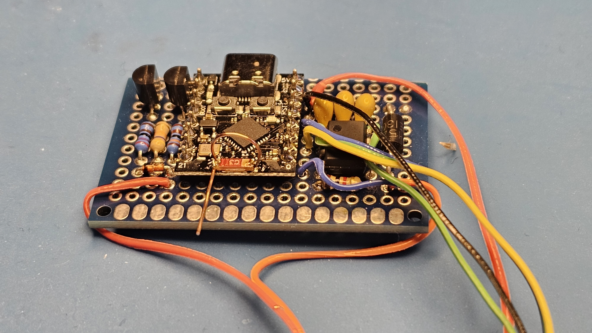 | 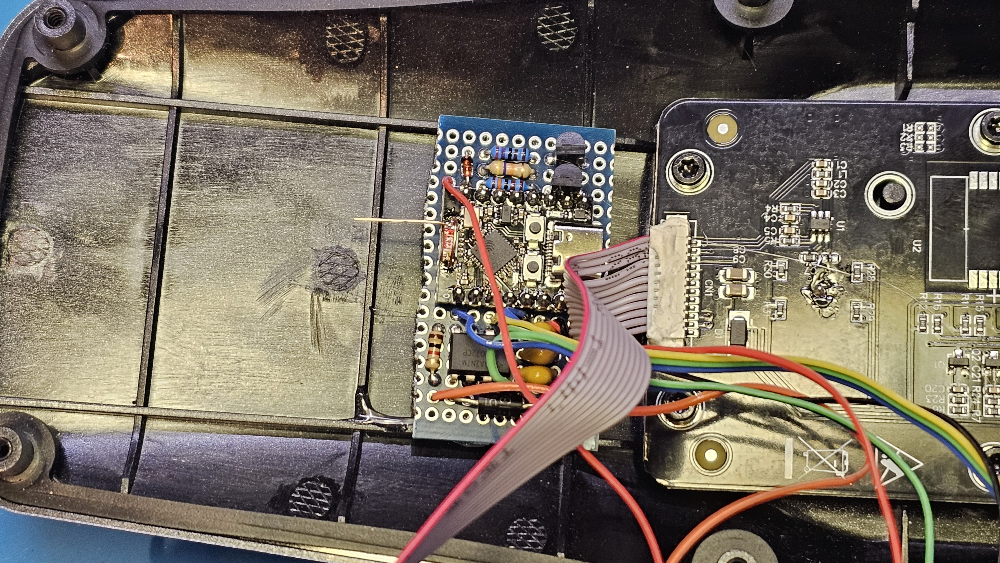 | 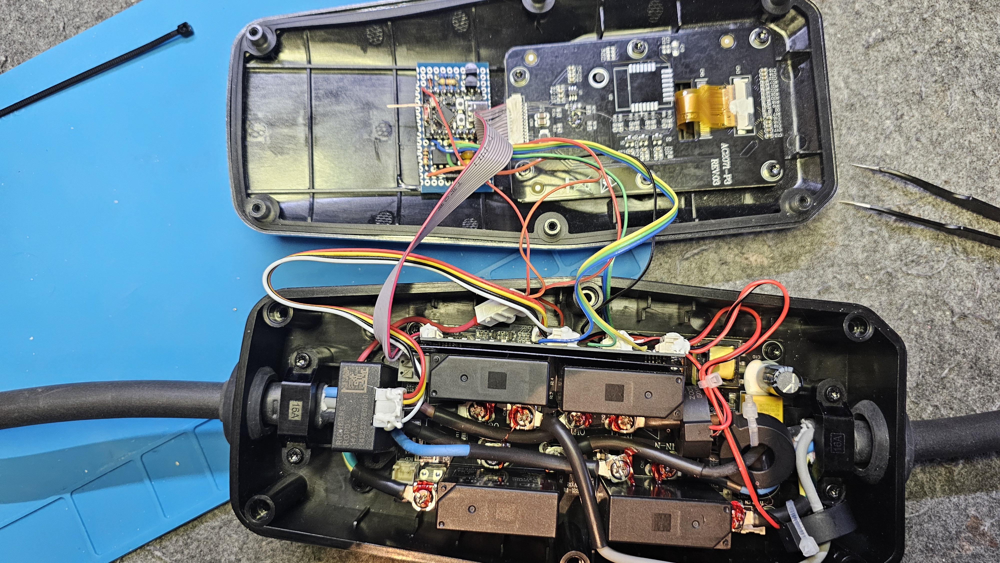 |

### Schematics
| CPU (ESP32-C3 Super Mini) | Charger CP control | EV CP control |
| - | - | - |
| 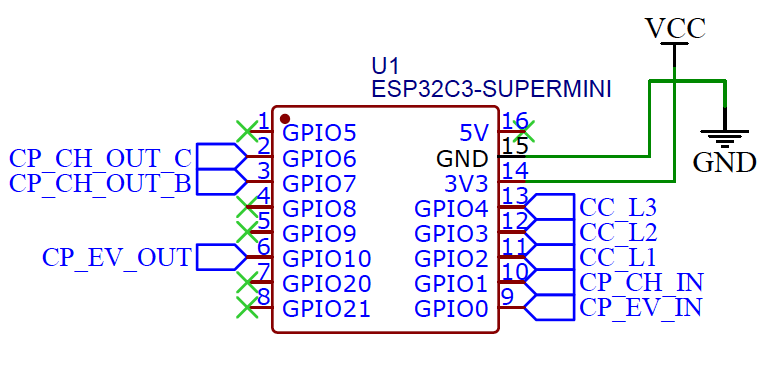 | 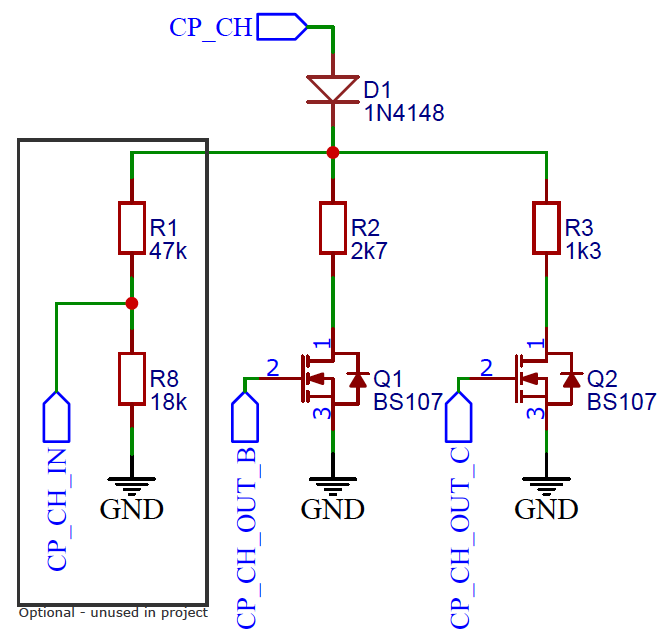 | 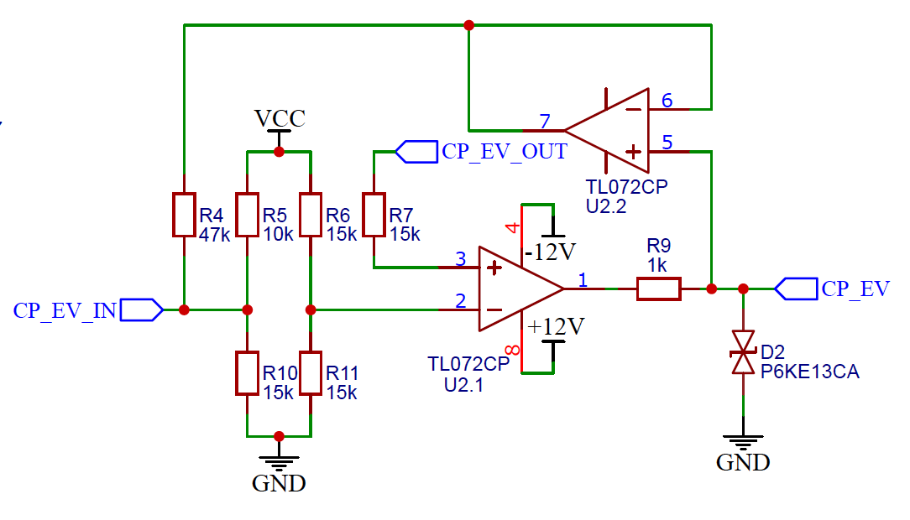 |

Complete schematics and board are available under [schematics/](./schematics/). 
| Signal | Pin | Function | Description |
|-|-|-|-|
| CP_CH_IN | GPIO1 | (ADC) | Measuring charger CP voltage (used for debugging). R1 and R8 can be omitted! |
| CP_CH_OUT_B | GPIO7 | (digital out) | Signal to charger that EV is connected |
| CP_CH_OUT_C | GPIO6 | (digital out) | Signal to charger that EV is requesting charging |
| CP_EV_IN | GPIO0 | (ADC) |  Measuring raw (including PWM) voltage at CP connected to EV |
| CP_EV_OUT | GPIO10 | (PWM out) | Generating PWM signal for EV that is amplified to ±12 V |
| CC_L1 | GPIO2 | (ADC) | Current clamp (CC) input (optional) for measuring Line 1 current |
| CC_L2 | GPIO3 | (ADC) | Current clamp (CC) input (optional) for measuring Line 2 current |
| CC_L3 | GPIO4 | (ADC) | Current clamp (CC) input (optional) for measuring Line 3 current |

If external antenna is required then [ESP32-C3 Super Mini Plus](https://www.espboards.dev/esp32/esp32-c3-super-mini-plus/) can be used instead of [antenna modification](https://peterneufeld.wordpress.com/2025/03/04/esp32-c3-supermini-antenna-modification/) on general-purpose [ESP32-C3 Super Mini](https://www.espboards.dev/esp32/esp32-c3-super-mini/) proposed here. There are other ESP32 super mini options [explainded here](https://www.espboards.dev/blog/esp32-super-mini-comparison/) if additional capabilities (e.g. more ADCs for internal and external CTs, Wi-Fi 6, LCD display) are required.

### Which Charger is compatible?

What charger can be used for this modification? We recommend the cheapest one without WiFi that has required power rating and safety protection including display showing measured current. Some chargers shown below can be found for under €130 for 3 phase 11 kW Type 2 that are most commonly used in EU cars. One phase chargers are even cheaper and easier to modify as they have less components inside.

| Andaiic | Feyree | Kolanky |
|-|-|-|
|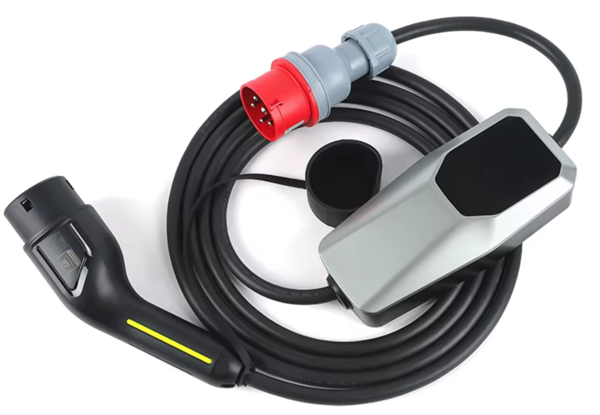 | 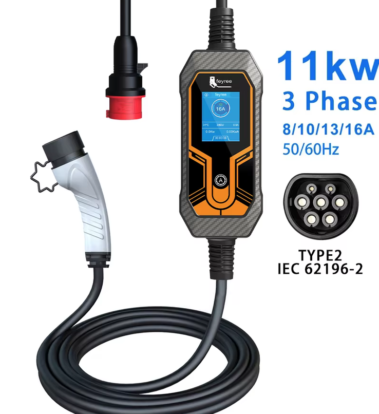 | 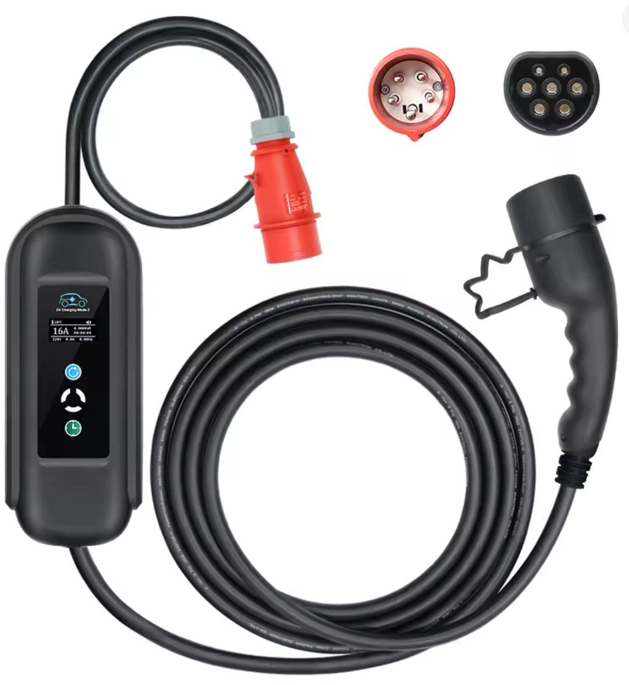 |

### Locating connections points inside a charger

There are several wires (up to 9) wires required to be soldered to existing charger. Most of them can be spotted by observing the PCB of the charger. 
The easiest is to spot tiny CP wire coming from the PCB to the EV charging cable. That CP wire is to be disconnected and AlienEVSE CP control will be put in the middle. 
Note that usually there is no Proximity Pilot (PP) wire going to the plug as the resistor describing cable strength is  installed in the handle directly to save on costs of the PP wire.  
| Wire name | Location | 
|-----------|----------|
| GND   | Ground is the largest area on the PCB being also around the PCB mounting holes |
| +12 V | Look for markings +12 under PCB or measure around CP amplifier or around linear regulators |
| -12 V | Similarly to +12 the voltage should be quite stable.* |
| +5 V  | Using 5V for powering ESP32 is recommended.* |
| +3.3V | Alternatively, +3.3 V can be used for powering ESP32.*  |
| CP    | Going to the charging cable. Break this wire and connect CP_CH and CP_EV signals in between |
| CC_L1 | If there are current transformers (CT have usually ratio 1000:1) connect to the live wire.** |
| CC_L2 | As with CC_L1 the CT can be attached to charger's sensor in parallel without affecting measurements.** |
| CC_L3 | All CC lines can be omitted or connected to external CTs for measuring complete grid |

*Note that 100 nF blocking capacitors are required on AlienEVSE board to block interference.

**Live wire can be found with multimeter when charging. There will be some positive (DC) offset to allow negative CT current. 
When measuring AC voltage (200 mV to 2V range) on one or another wire (eg. red or black) then one will show some AC voltage while another will be zero. Use that show some AC voltage proportional to charging current. 

### Testing

Prototype board can be easily tested without EV and charger provided +12 V and -12 V voltages for supply, while board can be powered though USB used for programming the ESP32-C3 module. Tor testing connect CP_CH and CP_EV wires together and simulate EV states by `CP_CH_OUT_B` and `CP_CH_OUT_C` signals. Note that charging logic inside `evse_update_state_script` needs to return early without changing `CP_CH_OUT_B` and `CP_CH_OUT_C` signals at the end of the `evse_update_state_script`.

## ESPHome software

Use [alienevse.yaml](./esphome/alienevse.yaml) as an example and modify ranges for your case. Burning firmware can be done through Home Asistant ESPHome builder or from a desktop with a Python using
~~~ bash
python -m venv install local
local/bin/pip install esphome
local/bin/esphome compile alienevse.yaml
local/bin/esphome upload alienevse.yaml
~~~

### `evse_cp_sampler` component

This repository includes a custom ESPHome component `evse_cp_sampler` that samples the EV Control Pilot (CP) voltage at a precise time relative to the PWM rising edge, then classifies the CP state (A/B/C/E) based on configurable ADC thresholds.

How it works (important for tuning):
- When PWM is running, the component arms a one-shot timer on each PWM rising edge and samples the configured ADC shortly after that edge.
- When PWM is not transitioning (100% DC or disabled), it falls back to a heartbeat sampler (~500 Hz).
- Samples are decimated and then median-filtered (internal window of 20). The `on_raw_value` callback receives this median-filtered ADC raw count.
- State classification runs on the same filtered value and emits `on_state_change` only when the classified state changes.

#### Configuration schema (required / optional / defaults)

```yaml
evse_cp_sampler:
    id: <id>                                  # required
    pwm_interrupt_pin: <internal gpio pin>     # required
    sample_adc: <adc_sensor_id>               # required

    # Optional behavior/timing
    samples: 250                               # optional, default: 250

    # Optional triggers
    on_raw_value:                              # optional
    	- ...                                    # x is int (median-filtered raw ADC count)
    on_state_change:                           # optional
    	- ...                                    # x is int state code: 0 unknown, 1 A, 2 B, 3 C, 4 E/F

    # Optional state thresholds (raw ADC counts)
    state_a_threshold: 4000                    # optional, default: 4000 (A if value > this)
    state_b_value: 3650                        # optional, default: 3650 (B if |value - this| < state_b_threshold)
    state_b_threshold: 150                     # optional, default: 150
    state_c_value: 3200                        # optional, default: 3200 (C if |value - this| < state_c_threshold)
    state_c_threshold: 150                     # optional, default: 150
    state_e_value: 755                         # optional, default: 755 (E/F if |value - this| < state_e_threshold)
    state_e_threshold: 150                     # optional, default: 150
```

Notes on the required fields:
- `pwm_interrupt_pin` must be the same GPIO that generates the EV CP PWM (the LEDC output pin). The component attaches a rising-edge interrupt to this pin. ESPHome
    will most likely warn you that this pin is already in use; to avoid this warning you can add `allow_other_uses: true` to both the `ledc` and `evse_cp_sampler` pin configurations.
- `sample_adc` must be an `adc` sensor configured with `attenuation: 12db` to cover the full ±12 V CP voltage range after appropriate voltage division and should never be left to `auto`.
    During `evse_cp_sampler` setup, the component will override the ADC's `update_interval`, `raw`, and `sample_count` settings.

#### When and how to tune the values

You typically only need to tune the state thresholds if your analog front-end (divider/op-amp), ADC attenuation, or supply/reference differs from the planned schematics.

Recommended tuning workflow:
1. Temporarily enable logging of `on_raw_value` (or publish it to a diagnostic sensor) so you can observe the median-filtered raw ADC counts.
2. Observe the stable raw counts for each CP state (A ≈ +12V, B ≈ +9V, C ≈ +6V, E/F ≈ negative CP / fault depending on your conditioning circuit).
3. Set:
	 - `state_b_value`, `state_c_value`, `state_e_value` to the observed centers.
	 - `state_*_threshold` to a margin that covers noise/variation but is small enough not to overlap adjacent states.
	 - `state_a_threshold` to a value safely above your highest observed B value (A is the only state detected as “greater than”).


[releases-shield]: https://img.shields.io/github/v/release/kosl/alienevse
[commits-shield]: https://img.shields.io/github/commit-activity/m/kosl/alienevse
[last-commit-shield]: https://img.shields.io/github/last-commit/kosl/alienevse
[platform-shield]: https://img.shields.io/badge/platform-ESPHome-blue

[releases]: https://github.com/kosl/alienevse/releases
[commits]: https://github.com/kosl/alienevse/commits/main
